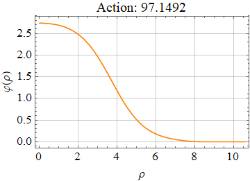

# FindBounce
Computes the `Bounces` of a false vacuum decay with multiple scalar fields in QFT.

[](https://github.com/vguada/FindBounce/releases)


## Installation

The following description is for people who just want to use the package functionality and
are not interested in package development.
To use _FindBounce_ package you need Mathematica version 10. or later.

_FindBounce_ package is released in the `.paclet` file format, which contains code,
documentation and other necessary resources.
Download the latest `.paclet` file from the
repository ["releases"](https://github.com/vguada/FindBounces/releases) page
to your computer and install it by evaluating the following command in the Mathematica:

```mathematica
(* This built-in package is usually loaded automatically at kernel startup. *)
Needs["PacletManager`"]

(* Path to .paclet file downloaded from repository "releases" page. *)
PacletInstall["full/path/to/FindBounce-X.Y.Z.paclet"]
```

This will permanently install the _FindBounce_ package to `$UserBasePacletsDirectory`.
To update the documentation it may be necessary to restart Mathematica.
Mathematica will always use the latest installed version of package and all installed versions
can be enumerated by evaluating `PacletFind["FindBounce"]`.
You can get more detailed information about the package with `PacletInformation["FindBounce"]`.
All versions can be uninstalled with:

```mathematica
PacletUninstall["FindBounce"]
```

## Usage

After you have installed the paclet, load it to Mathematica session with `Get`.

```mathematica
Get["FindBounce`"]

U[x_] := .5 x^2 - .5 x^3 + .1 x^4;
Extrema = Block[{x}, x /. Sort@NSolve[(D[U[x], x]) == 0, x]];
PB =  FindBounce[ U[x], {x}, {Extrema[[1]], Extrema[[3]]},"Dimensions" -> 3]
BouncePlot[PB, PlotLabel -> Row[{"Action: ", PB["Action"]}]]
```



To access the documentation, open the notebook interface help viewer and search for FindBounce.

## Contributing and bug reports

Please use the repository  page to submit bugs or feature ideas.

Contributions to this repository are very welcome.
Guidelines on how to build paclet file from source code can be found in  file.
