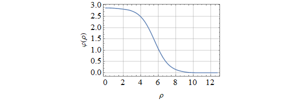

# FindBounce

_FindBounce_ is a [Mathematica](http://www.wolfram.com/mathematica/) package
which computes the bounces of a false vacuum decay with multiple scalar fields.  
Its background is described in the paper by [Guada, Maiezza and Nemevšek (2019)](https://arxiv.org/abs/1803.02227).


## Installation

To use _FindBounce_ package you need Mathematica version 10. or later.
The package is released in the `.paclet` file format, which contains code,
documentation and other necessary resources.
Download the latest `.paclet` file from the
repository ["releases"](https://github.com/vguada/FindBounces/releases) page
to your computer and install it by evaluating the following command in the Mathematica:

```mathematica
(* This built-in package is usually loaded automatically at kernel startup. *)
Needs["PacletManager`"]

(* Path to .paclet file downloaded from repository "releases" page. *)
PacletInstall["full/path/to/FindBounce-X.Y.Z.paclet"]
```

This will permanently install the _FindBounce_ package to `$UserBasePacletsDirectory`.
To update the documentation it may be necessary to restart Mathematica.
Mathematica will always use the latest installed version of package and all installed versions
can be enumerated by evaluating `PacletFind["FindBounce"]`.
You can get more detailed information about the package with `PacletInformation["FindBounce"]`.
All versions can be uninstalled with:

```mathematica
PacletUninstall["FindBounce"]
```

## Usage

After you have installed the paclet, load it to Mathematica session with `Needs`.
To access the documentation, open the notebook interface help viewer and search for "FindBounce".

```mathematica
Needs["FindBounce`"]
```
Define one field potential, find its extrema and plot it.

```mathematica
potential[x_] := 0.5 x^2 - 0.5 x^3 + 0.1 x^4;

extrema = Block[{x}, x /. NSolve[D[potential[x], x] == 0, x]]
(* {0., 0.867218, 2.88278} *)

pts = Transpose[{extrema, potential /@ extrema}]
Plot[
    potential[x],
    {x, -1, 4},
    Epilog -> {Red, PointSize[Large], Point[pts]}
]
 ```


Use the main function `FindBounce` to calculate result in form of `BounceFunction` object.
It can be queried about different properties, like euclidean action.

 ```mathematica
bf = FindBounce[potential[x], {x}, {0., 2.882}, "Dimension" -> 3]
(* Returns BounceFunction[...]*)

bf["Action"]
(* 95.1162 *)

bf["Properties"]
(* {"Action", "Coefficients", "Dimension", "Domain", "InitialSegment",  "Path", "Potential", "Radii", "Segments"} *)
 ```

Plot the bounce field configuration.

 ```mathematica
BouncePlot[bf]
```



## Contributing and feedback

Please use the repository ["issues"](https://github.com/vguada/FindBounces/issues) page to submit bugs or feature ideas.
If you find this package useful, feel free to send feedback by email to `victor.guada(at)ijs.si`.

Pull requests to this repository are welcome.
For major changes, please open an issue first to discuss what you would like to change.
Instructions on building the `.paclet` file from source code can be found in [CONTRIBUTING.md]( CONTRIBUTING.md ) file.

## License

[GPLv3](https://choosealicense.com/licenses/gpl-3.0/)
