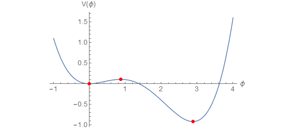

# FindBounce

_FindBounce_ is a [Mathematica](http://www.wolfram.com/mathematica/) package
that computes the bounce configuration needed to compute the false vacuum decay rate with multiple scalar fields.  
The physics background is described in the paper by [Guada, Maiezza and Nemevšek (2019)](https://arxiv.org/abs/1803.02227).


## Installation

To use the _FindBounce_ package you need Mathematica version 10.0 or later.
The package is released in the `.paclet` file format that contains the code, documentation and other necessary resources.
Download the latest `.paclet` file from the repository ["releases"](https://github.com/vguada/FindBounce/releases) page
to your computer and install it by evaluating the following command in the Mathematica:

```mathematica
(* Path to .paclet file downloaded from repository "releases" page. *)
PacletInstall["full/path/to/FindBounce-X.Y.Z.paclet"]
```

This will permanently install the _FindBounce_ package to `$UserBasePacletsDirectory`.
Mathematica will always use the latest installed version of the package and all installed versions
can be enumerated by evaluating `PacletFind["FindBounce"]`.
You can get more detailed information about the package with `PacletInformation["FindBounce"]`.
All versions can be uninstalled with:

```mathematica
PacletUninstall["FindBounce"]
```

## Usage

After installing the paclet, load it in the Mathematica session with `Needs`.
To access the documentation, open the notebook interface help viewer and search for "FindBounce".
The first time after package installation, sometimes Mathematica needs to
be restarted to update the documentation search index.

```mathematica
Needs["FindBounce`"]
```

To begin, let us define a single field potential, find its extrema and plot it.

```mathematica
potential[x_] := 0.5 x^2 - 0.5 x^3 + 0.1 x^4;

extrema = Block[{x}, x /. NSolve[D[potential[x], x] == 0, x]]
(* {0., 0.867218, 2.88278} *)

pts = Transpose[{extrema, potential /@ extrema}]
Plot[
    potential[x],
    {x, -1, 4},
    Epilog -> {Red, PointSize[Large], Point[pts]}
]
 ```



Now we simply evaluate the `FindBounce` function on this potential going from one minimum to the other.
The results are stored in a `BounceFunction` object, that stores the results of the calculation
and properties of the solution, like the Euclidean action.

 ```mathematica
bf = FindBounce[potential[x], {x}, { extrema[[1]], extrema[[3]] }]
(* BounceFunction[...]*)

bf["Action"]
(* 1515.5 *)

bf["Dimension"]
(* 4 *)
 ```

The field configuration can also be easily plotted with `BouncePlot` function.

 ```mathematica
BouncePlot[bf]
```


## Contributing and feedback

Please use the repository ["issues"](https://github.com/vguada/FindBounces/issues) page to submit bugs or feature ideas.
If you find this package useful, feel free to send feedback by email to `victor.guada(at)ijs.si`.

Pull requests to this repository are welcome.
For major changes, please open an issue first to discuss what you would like to change.
Instructions on building the `.paclet` file from source code can be found in [CONTRIBUTING.md]( CONTRIBUTING.md ) file.

## License

[GNU General Public License v3.0](https://choosealicense.com/licenses/gpl-3.0/)
